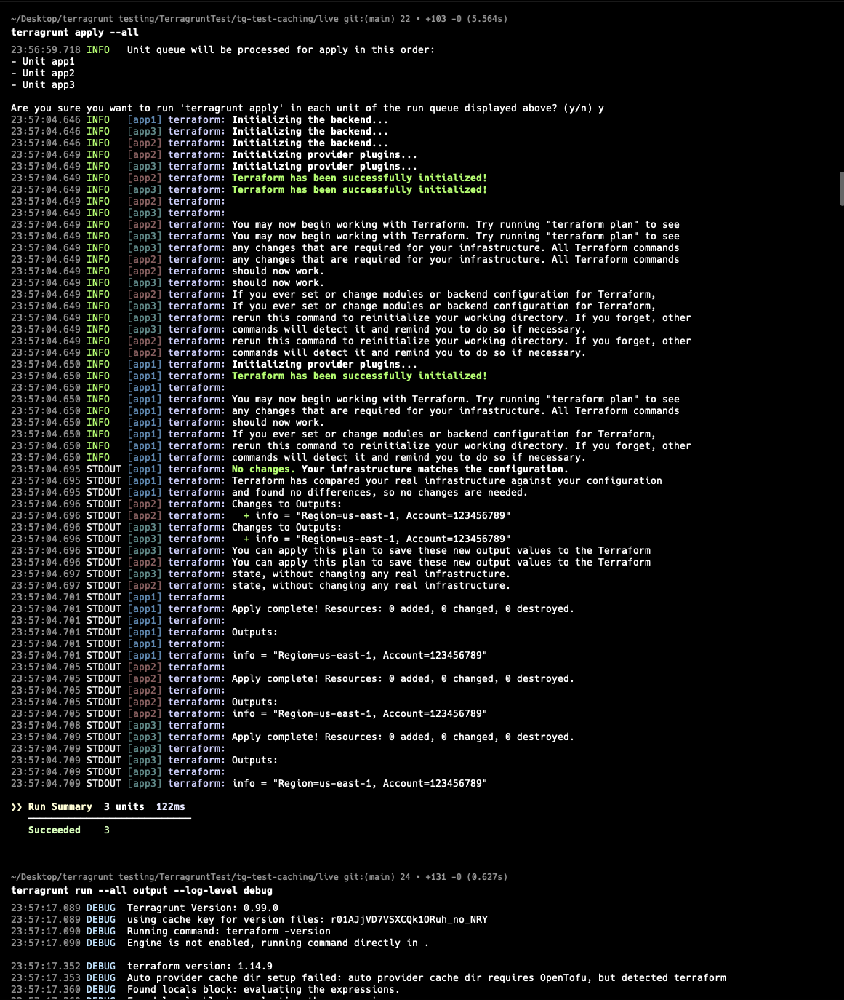
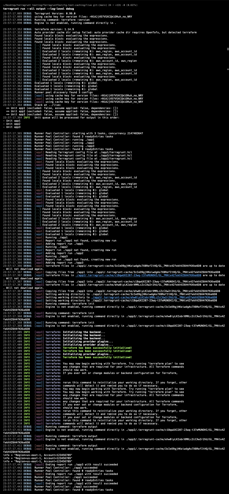

# Testing `global.hcl` Config Parsing Across Modules

## Step 1 — Apply the Infrastructure

First, I ran:

```bash
terragrunt apply --all
```

This was done to ensure that all modules received and processed the shared configuration values from `global.hcl`, such as:

- `aws_region`
- `aws_account_id`

and that the outputs were properly stored in the Terraform state.



---

## Step 2 — Run Terragrunt with Debug Logs

Then I executed:

```bash
terragrunt run --all output --log-level debug
```

to observe how Terragrunt processes the shared configuration internally.



---

## Observation

From the debug logs, I observed that for each module (`app1`, `app2`, `app3`):

- Terragrunt reads the module-specific `terragrunt.hcl`
- `read_terragrunt_config()` is executed
- `global.hcl` is evaluated
- the locals from `global.hcl` (`aws_region`, `aws_account_id`) are parsed repeatedly for every module

The repeated log entries such as:

```text
Evaluated 2 locals (remaining 0): aws_region, aws_account_id
```

appear multiple times during execution, indicating that the same `global.hcl` configuration is being parsed independently for each module instead of being reused from a shared cache.

---

## Current Understanding

Based on this observation, Terragrunt appears to:

1. Parse `global.hcl`
2. Evaluate the locals
3. Pass the evaluated values to the target module
4. Repeat the same process again for the next module

even though the shared configuration content remains unchanged across all modules.

This behavior helps illustrate the repeated parsing/evaluation overhead that the caching optimization is intended to reduce.