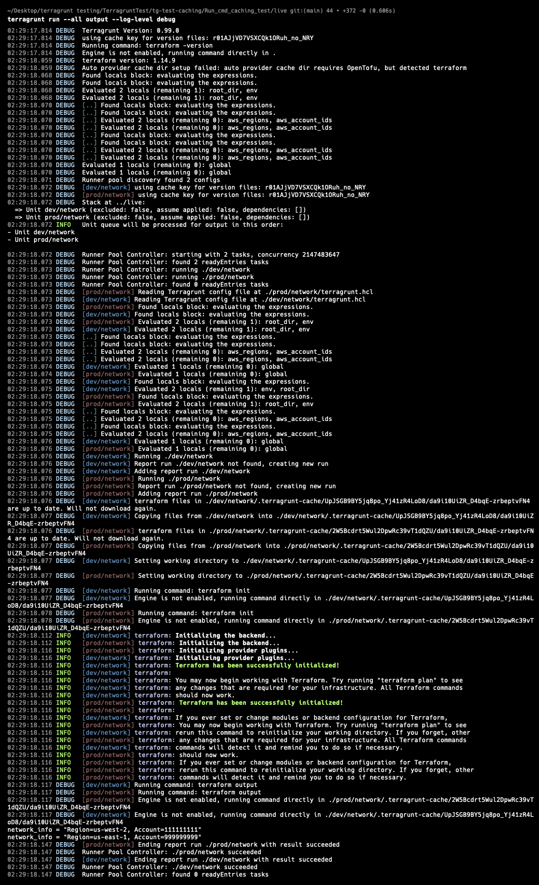

# Testing `global.hcl` Parsing and `run_cmd` Global Cache

## Objective

The goal of this test was to observe how Terragrunt processes a shared `global.hcl` across multiple modules and how:

```hcl
run_cmd("--terragrunt-global-cache", ...)
```

behaves in different environments.

---

# Project Structure

```text
live/
├── dev/network
└── prod/network
```

Both modules load the same shared `global.hcl` using:

```hcl
read_terragrunt_config(find_in_parent_folders("global.hcl"))
```

---

# Step 1 — Apply Infrastructure

```bash
terragrunt run --all apply
```

This creates the Terraform state and module outputs.

---

# Step 2 — Run with Debug Logs

```bash
terragrunt run --all output --log-level debug
```



---

# Observation

From the debug logs, Terragrunt repeatedly:

1. Reads module-specific `terragrunt.hcl`
2. Executes `read_terragrunt_config()`
3. Evaluates `global.hcl`
4. Evaluates locals from the shared config

Repeated log entries such as:

```text
Evaluated 2 locals (remaining 0): aws_regions, aws_account_ids
```

appear multiple times during execution.

This indicates that `global.hcl` is evaluated independently for each module execution.

---

# Environment Validation

The outputs confirmed that environment-specific values were correctly isolated.

## Dev

```text
Region=us-west-2
Account=111111111
```

## Prod

```text
Region=us-east-1
Account=999999999
```

This confirms that cached `run_cmd()` results are not incorrectly reused across environments.

---

# Key Finding

`--terragrunt-global-cache` caches:

```text
run_cmd() execution results
```

but does not cache:

```text
read_terragrunt_config()
global.hcl parsing
locals evaluation
```

Terragrunt still re-evaluates the shared configuration for each module execution.
